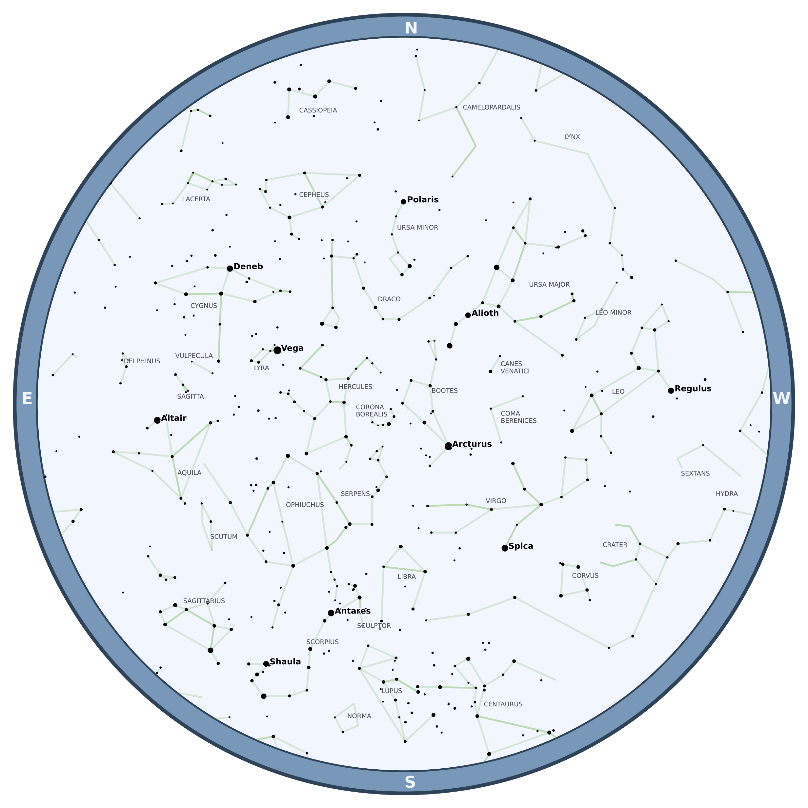

# ⭐ starplot 💫


**starplot** is a Python library for creating star charts and maps.

## Example


For more styles, check out the [examples](examples/).

## Getting Started

To create a star chart for tonight's sky as seen from [Palomar Mountain](https://en.wikipedia.org/wiki/Palomar_Mountain) in California:

```python
from datetime import datetime
from starplot.charts import create_star_chart
from starplot.styles import BLUE

create_star_chart(
    lat=33.363484, 
    lon=-116.836394
    dt=datetime.now().replace(hour=22),
    tz_identifier="America/Los_Angeles", 
    filename="starchart.png",
    style=BLUE,
)
```

## Core Dependencies

- pandas
- matplotlib
- numpy
- pydantic
- skyfield
- adjustText

## Coming Soon

- Deep Sky Objects (DSOs)
- Support for plotting additional objects (and styling per object)
- Documentation

## License
[MIT](LICENSE)

