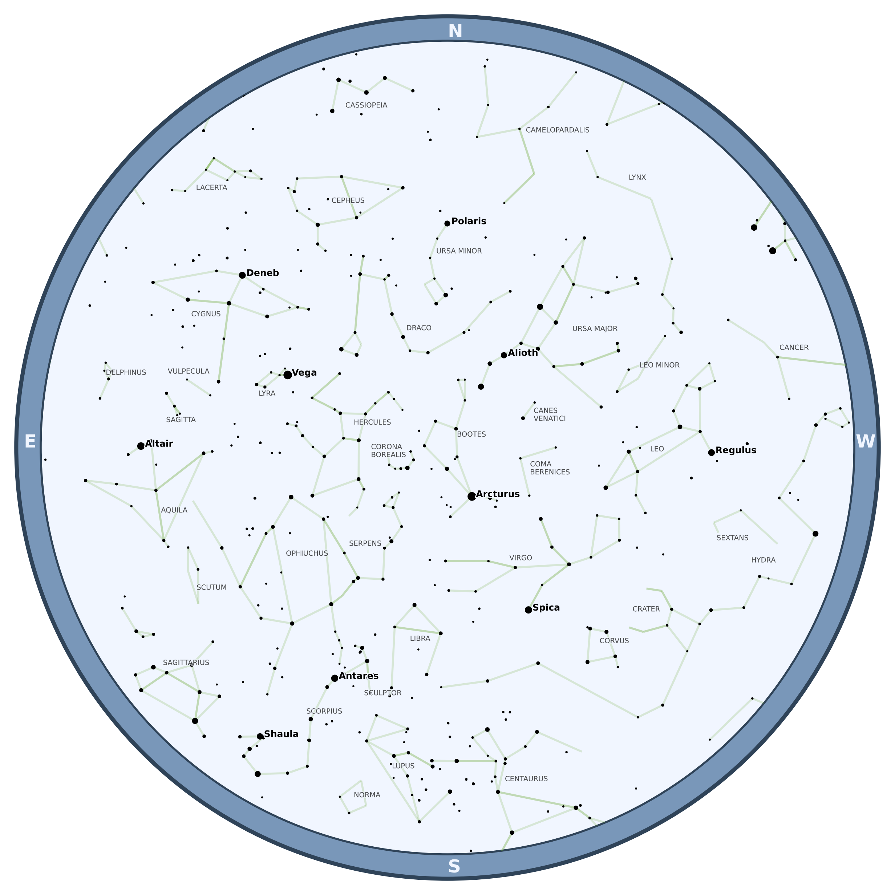

# ⭐ starplot 💫
Python library for creating star charts and maps

## Examples

## Coming Soon

- Deep Sky Objects (DSOs)
- Support for plotting additional objects (and styling per object)
- Documentation

## How To
- Create basic star chart
- Create new style
- Add additional objects

