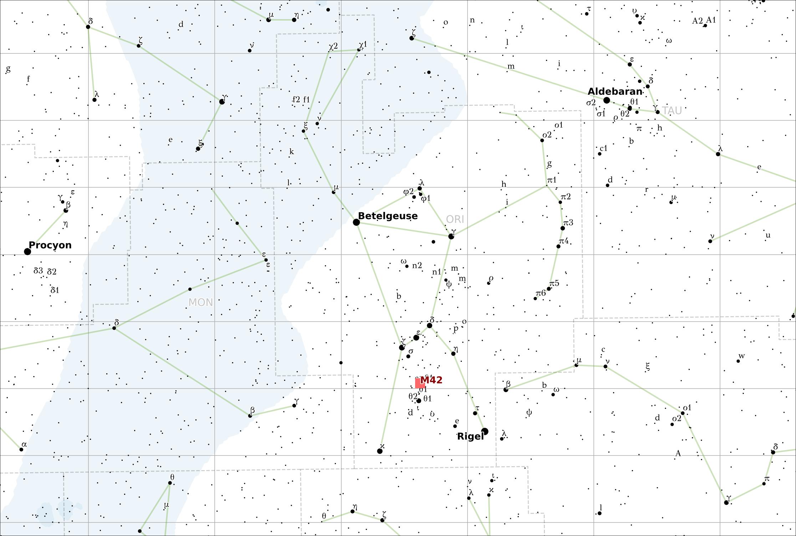

#  Starplot


**starplot** is a Python library for creating star charts and maps.

- ⭐ **Zenith Plots** - showing the stars from a specific time/location
- 🗺️ **Map Plots** - including North/South polar and Mercator projections
- 🎨 **Custom Styles** - for all objects
- 📥 **Export** - png, svg
- 🧭 **Label Collision Avoidance**

## Examples
*Zenith plot of the stars from a specific time/location:*


*Map around the constellation Orion, with M42 marked:*


[More examples](examples/)

## Getting Started

To create a star chart for tonight's sky as seen from [Palomar Mountain](https://en.wikipedia.org/wiki/Palomar_Mountain) in California:

```python
from datetime import datetime
from pytz import timezone
import starplot as sp

p = sp.ZenithPlot(
    lat=33.363484, 
    lon=-116.836394,
    dt=timezone("America/Los_Angeles").localize(datetime.now().replace(hour=22)),
    limiting_magnitude=4.6,
    style=sp.styles.BLUE,
    resolution=2000,
)
p.export("starchart.png")
```

## Core Dependencies

- matplotlib
- pandas
- numpy
- geopandas
- cartopy
- skyfield
- pydantic
- adjustText

## Coming Soon

- 🔭 Scope plots - that will simulate what you'll see through a telescope eyepiece
- 🪐 More objects - including planets, and a base library of deep sky objects (DSOs)
- 💫 Plotting ecliptic
- 🌐 RA/DEC Labels
- ⚖️ Better auto font-size adjustment
- ☄️ Better label collision detection and handling

## License
[MIT License](LICENSE)
