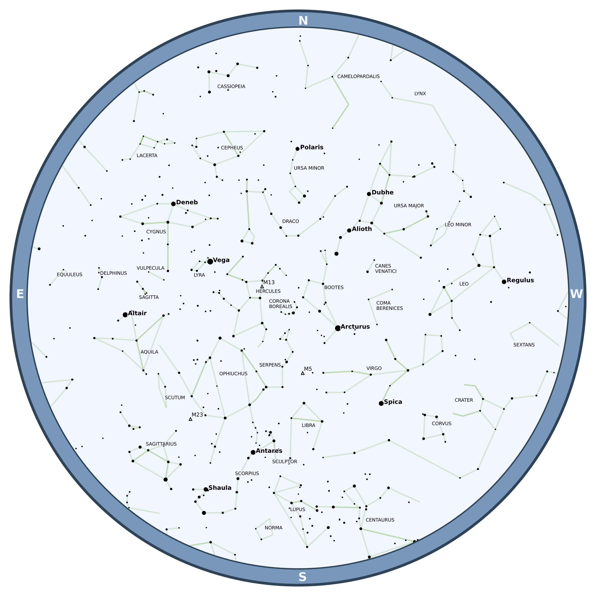
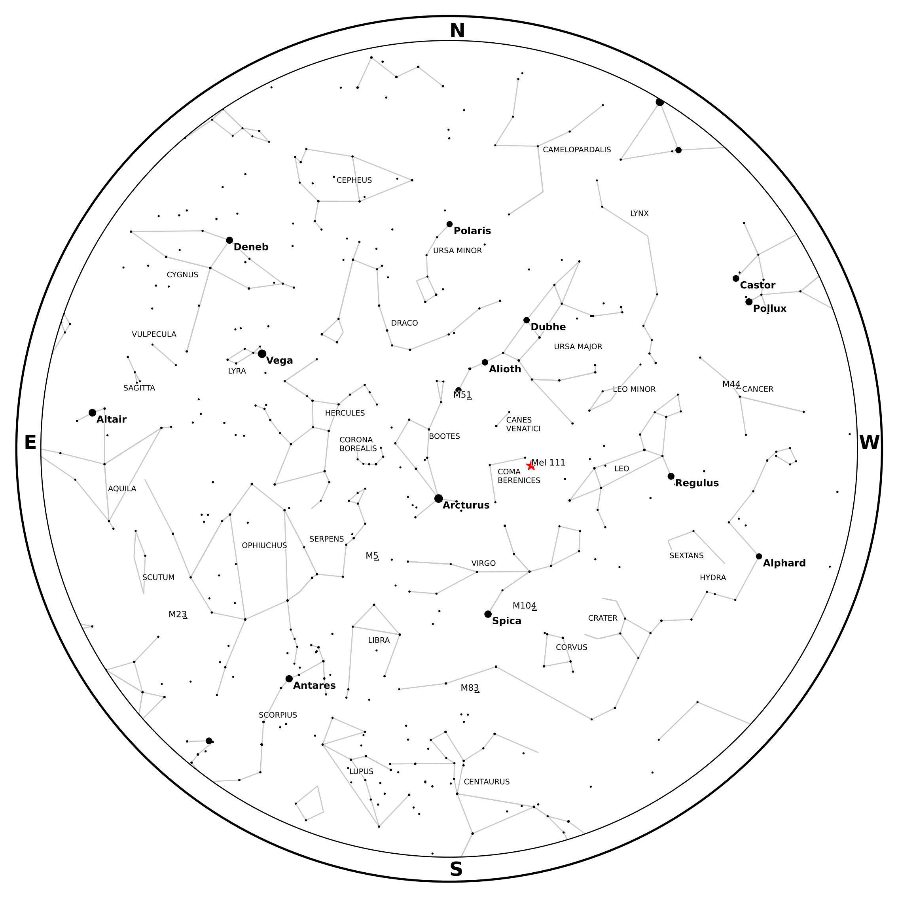
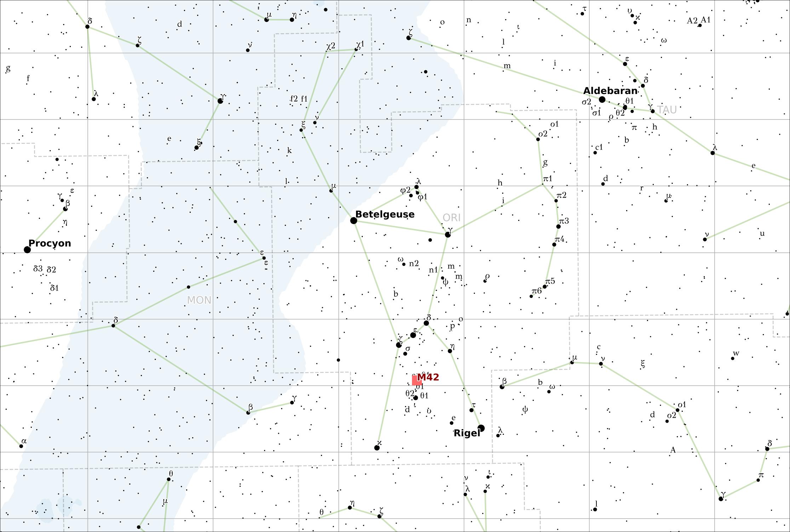

This page has a few examples to get you familiar with Starplot and how it works.

1. [Star Chart for Time/Location](#star-chart-for-timelocation)
2. [Star Chart with an Extra Object Plotted](#star-chart-with-an-extra-object-plotted)
3. [Map of Orion](#map-of-orion)

## Star Chart for Time/Location
To create a star chart for tonight's sky as seen from [Palomar Mountain](https://en.wikipedia.org/wiki/Palomar_Mountain) in California:

```python
from datetime import datetime
from pytz import timezone
import starplot as sp

tz = timezone("America/Los_Angeles")

p = sp.ZenithPlot(
    lat=33.363484, 
    lon=-116.836394,
    dt=tz.localize(datetime.now().replace(hour=22)),
    limiting_magnitude=4.6,
    style=sp.styles.BLUE,
    resolution=2000,
)
p.export("starchart.png")
```
The created file should look something like this:



!!! info "Does your result look different?"

    Your result may look a little different depending on the date/time you run this code (because the position of the stars in the sky depends on time/location). But, the example above reflects what the chart would like for a day in July.


## Star Chart with an Extra Object Plotted

Building on the first example, you can also plot additional objects and even customize their style. Here's an example that plots the [Coma Star Cluster](https://en.wikipedia.org/wiki/Coma_Star_Cluster) (Melotte 111) as a red star and also changes the plot style to `GRAYSCALE`:

```python
from datetime import datetime
from pytz import timezone
import starplot as sp

tz = timezone("America/Los_Angeles")

p = sp.ZenithPlot(
    lat=32.97,
    lon=-117.038611,
    dt=tz.localize(datetime.now().replace(hour=22)),
    limiting_magnitude=4.6,
    style=sp.styles.GRAYSCALE,
    resolution=2000,
)
p.plot_object(
    SkyObject(
        name="Mel 111",
        ra=12.36,
        dec=25.85,
        style={
            "marker": {"size": 10, "symbol": "*", "fill": "full", "color": "red"}
        },
    )
)
p.export("starchart-coma.png")

```




## Map of Orion

The following code will create a simple map plot that shows the area around the constellation Orion, including an extra marker for M42 - The Great Orion Nebula:

```python
import starplot as sp

style = sp.styles.MAP_BLUE.extend(
    {
        "bayer_labels": {
            "font_name": "GFS Didot",  # use a better font for Greek letters
            "font_size": 7,
            "font_alpha": 0.9,
        },
    }
)
style.star.label.font_size = 11

p = sp.MapPlot(
    projection=Projection.MERCATOR,
    ra_min=3.6,
    ra_max=7.8,
    dec_min=-16,
    dec_max=23.6,
    limiting_magnitude=7.2,
    style=style,
    resolution=4000,
)
p.plot_object(
    SkyObject(
        name="M42",
        ra=5.58333,
        dec=-4.61,
        style={
            "marker": {
                "size": 10,
                "symbol": "s",
                "fill": "full",
                "color": "#ff6868",
                "alpha": 1,
                "zorder": 4096,
            },
            "label": {
                "font_size": 10,
                "font_weight": "bold",
                "font_color": "darkred",
                "zorder": 4096,
            },
        },
    )
)
p.export("orion.svg", format="svg")


```
The result should look something like this:


