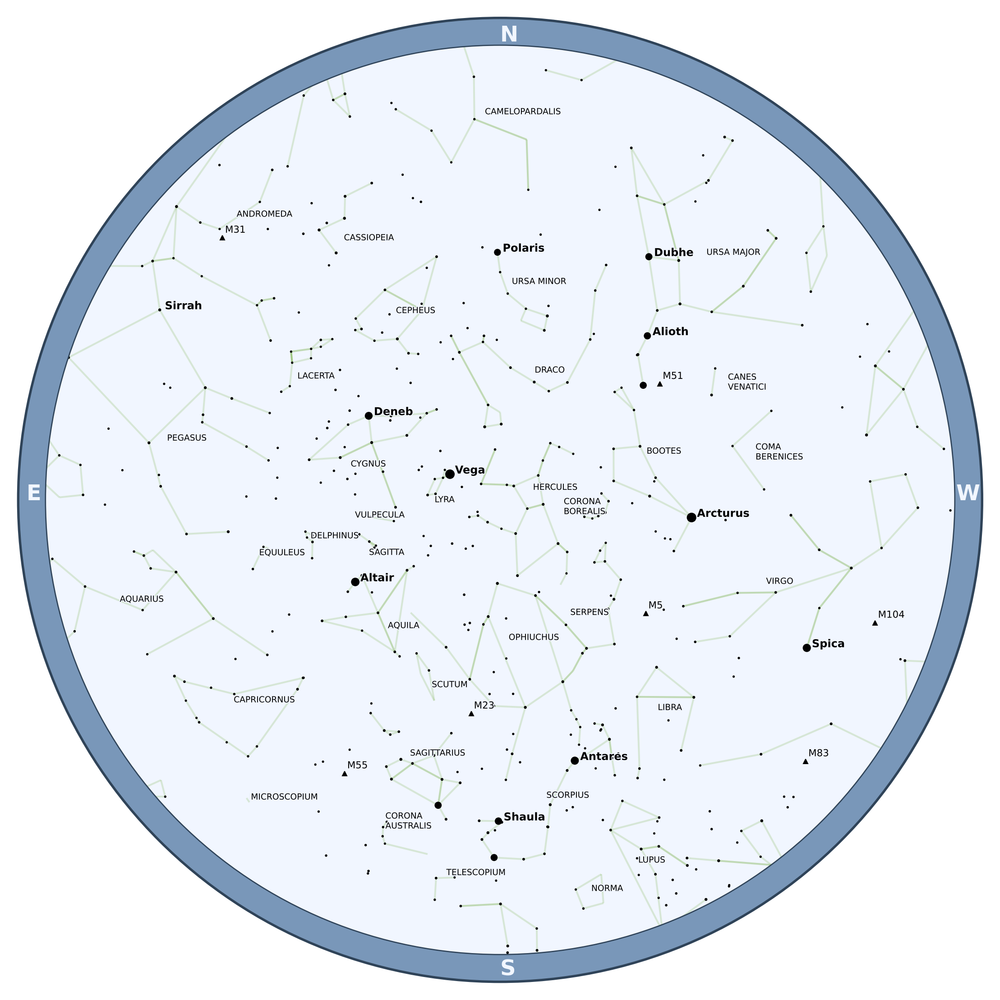
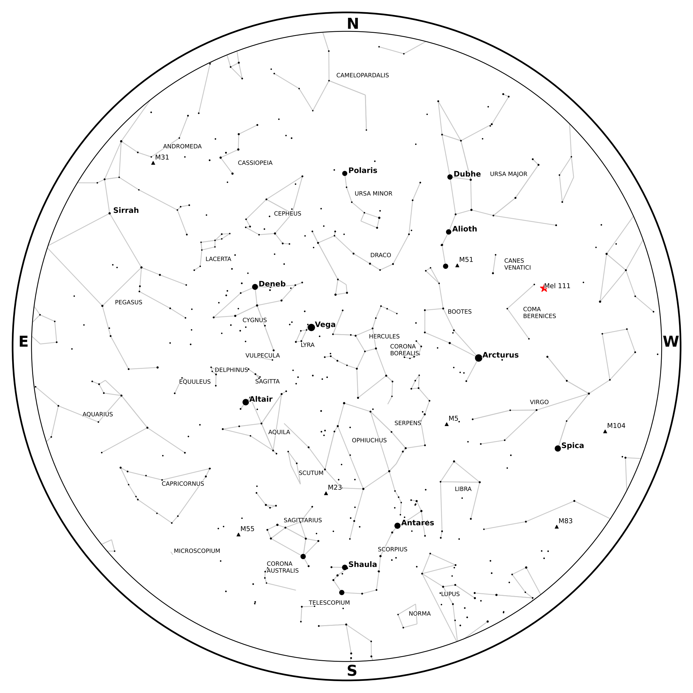
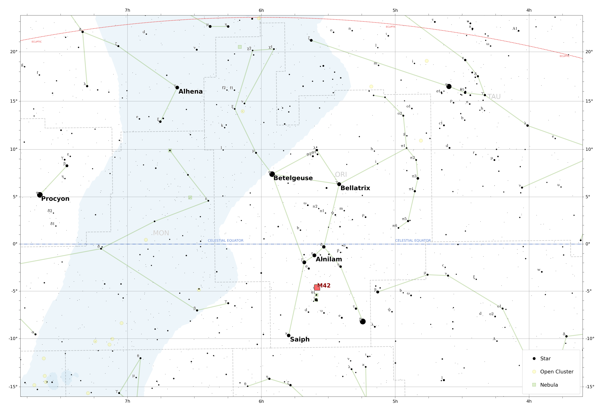
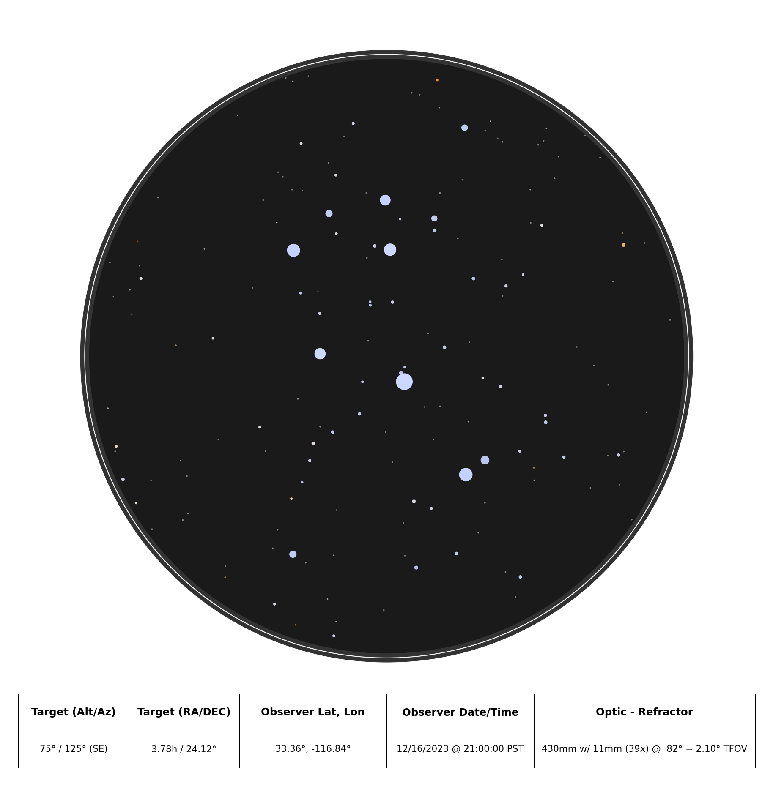

This page has a few examples to get you familiar with Starplot and how it works.

1. [Star Chart for Time/Location](#star-chart-for-timelocation)
2. [Star Chart with an Extra Object Plotted](#star-chart-with-an-extra-object-plotted)
3. [Map of Orion](#map-of-orion)
4. [Map of The Pleiades with a Scope Field of View](#map-of-the-pleiades-with-a-scope-field-of-view)
5. [Optic plot of The Pleiades with a Refractor Telescope](#optic-plot-of-the-pleiades-with-a-refractor-telescope)
6. [Map plot of The Big Dipper with Custom Markers](#map-of-the-big-dipper-with-custom-markers)


## Star Chart for Time/Location
To create a star chart for the sky as seen from [Palomar Mountain](https://en.wikipedia.org/wiki/Palomar_Mountain) in California on July 13, 2023 at 10pm PT:

```python
--8<-- "examples/example_01.py"
```

The created file should look like this:




## Star Chart with an Extra Object Plotted

Building on the first example, you can also plot additional objects and even customize their style. Here's an example that plots the [Coma Star Cluster](https://en.wikipedia.org/wiki/Coma_Star_Cluster) (Melotte 111) as a red star and also changes the plot style to `GRAYSCALE`:

```python
--8<-- "examples/example_02.py"
```




## Map of Orion

The following code will create a simple map plot that shows the area around the constellation Orion, including a legend and an extra marker for M42 - [The Great Orion Nebula](https://en.wikipedia.org/wiki/Orion_Nebula):

```python
--8<-- "examples/example_03.py"
```

The result should look like this:




## Map of The Pleiades with a Scope Field of View

The following code will create a minimal map plot that shows the field of view (red dashed circle) of [The Pleiades (M45)](https://en.wikipedia.org/wiki/Pleiades) when looking through a [Tele Vue 85](https://www.televue.com/engine/TV3b_page.asp?id=26) telescope with a 14mm eyepiece that has a 82 degree FOV:

```python
--8<-- "examples/example_04.py"
```

The result should look like this:


!!! tip "Binocular Field of View"

    You can also plot a circle showing the field of view of binoculars with the `plot_bino_fov` function:

    ```python
    p.plot_bino_fov(ra=3.78361, dec=24.11667, fov=65, magnification=10)
    ```


## Optic Plot of The Pleiades with a Refractor Telescope

The following code will create an optic plot that shows what The Pleiades looked like through a refractor telescope on December 16, 2023 at 9pm PT from Palomar Mountain in California.

```python
--8<-- "examples/example_05.py"
```

The result should look like this:




## Map of The Big Dipper with Custom Markers

Here's a fun one 😃 Let's create a small plot of the big dipper ([Ursa Major](https://en.wikipedia.org/wiki/Ursa_Major)), but with custom star-shaped markers:

```python
--8<-- "examples/example_06.py"
```

The result should look like this:


---

*Check out the code reference to learn more about using starplot!*