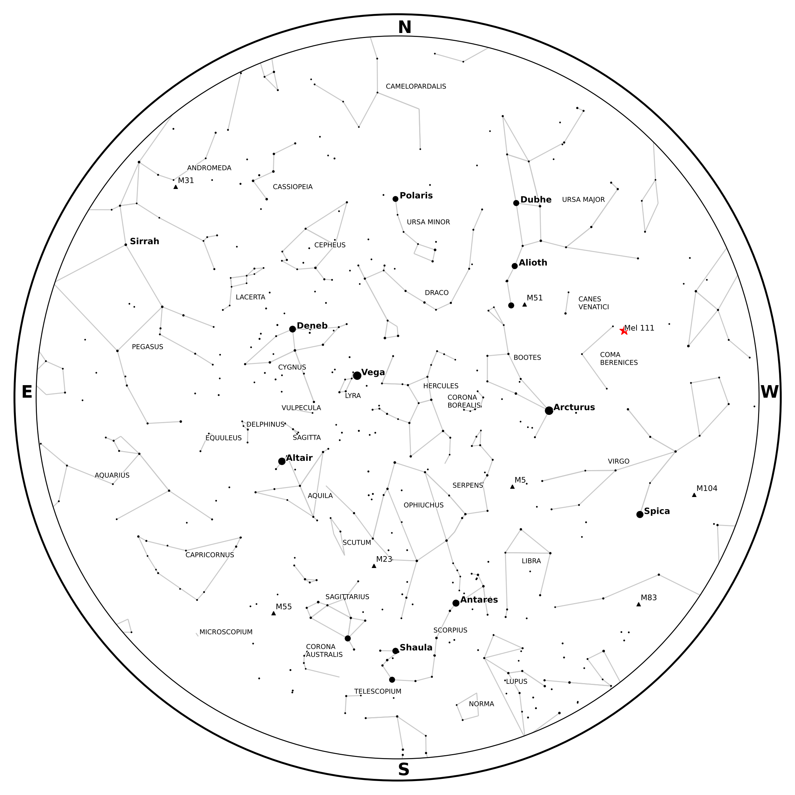
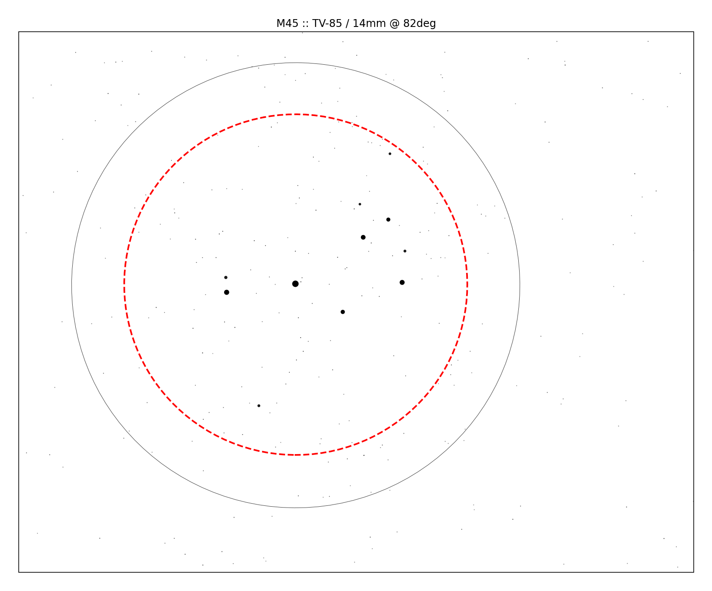
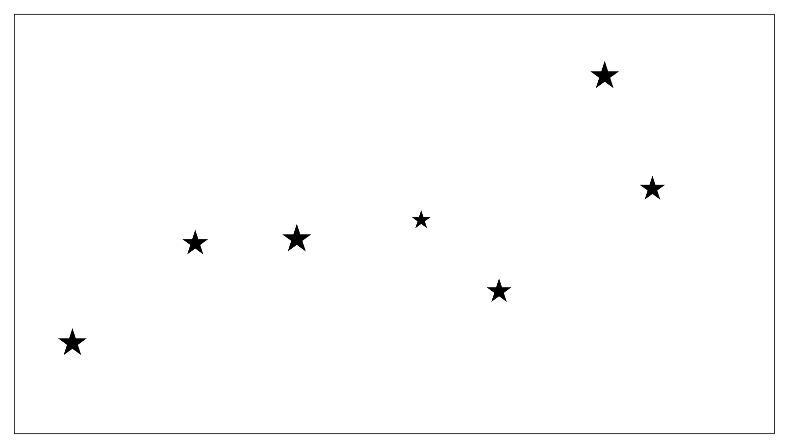

This page has a few examples to get you familiar with Starplot and how it works.

1. [Star Chart for Time/Location](#star-chart-for-timelocation)
2. [Star Chart with More Detail](#star-chart-with-more-detail)
3. [Map of Orion](#map-of-orion)
4. [Map of The Pleiades with a Scope Field of View](#map-of-the-pleiades-with-a-scope-field-of-view)
5. [Optic plot of The Pleiades with a Refractor Telescope](#optic-plot-of-the-pleiades-with-a-refractor-telescope)
6. [Map of The Big Dipper with Custom Markers](#map-of-the-big-dipper-with-custom-markers)
7. [Map of Hale-Bopp in 1997](#map-of-hale-bopp-in-1997)

## Star Chart for Time/Location
To create a star chart for the sky as seen from [Palomar Mountain](https://en.wikipedia.org/wiki/Palomar_Mountain) in California on July 13, 2023 at 10pm PT:

```python
--8<-- "examples/example_01.py"
```

The created file should look like this:


## Star Chart with More Detail

Building on the first example, you can also plot additional objects and even customize their style. Here's an example that plots a bunch of extra stuff (including the Milky Way, constellation borders, Deep Sky Objects, and more). It also demonstrates how you can plot your own markers, like the purple circle around the [Coma Star Cluster](https://en.wikipedia.org/wiki/Coma_Star_Cluster) (Melotte 111):

```python
--8<-- "examples/example_02.py"
```




## Map of Orion

The following code will create a simple map plot that shows the area around the constellation Orion, including a legend and an ellipse around [Orion's Belt](https://en.wikipedia.org/wiki/Orion%27s_Belt):

```python
--8<-- "examples/example_03.py"
```

The result should look like this:


## Map of The Pleiades with a Scope Field of View

The following code will create a minimal map plot that shows the field of view (red dashed circle) of [The Pleiades (M45)](https://en.wikipedia.org/wiki/Pleiades) when looking through a [Tele Vue 85](https://www.televue.com/engine/TV3b_page.asp?id=26) telescope with a 14mm eyepiece that has a 82 degree FOV:

```python
--8<-- "examples/example_04.py"
```

The result should look like this:



_The solid black circle in this plot is the extent of the Pleiades as defined in [OpenNGC](https://github.com/mattiaverga/OpenNGC)._

!!! star "Binocular Field of View"

    You can also plot a circle showing the field of view of binoculars with the `bino_fov` function:

    ```python
    p.bino_fov(ra=3.78361, dec=24.11667, fov=65, magnification=10)
    ```


## Optic Plot of The Pleiades with a Refractor Telescope

The following code will create an optic plot that shows what The Pleiades looked like through a refractor telescope on December 16, 2023 at 9pm PT from Palomar Mountain in California.

```python
--8<-- "examples/example_05.py"
```

The result should look like this:


## Map of The Big Dipper with Custom Markers

Here's a fun one 😃 Let's create a small plot of the big dipper ([Ursa Major](https://en.wikipedia.org/wiki/Ursa_Major)), but with custom star-shaped markers:

```python
--8<-- "examples/example_06.py"
```

The result should look like this:




## Map of Hale-Bopp in 1997

Here's an example that uses [Skyfield](https://rhodesmill.org/skyfield/) to get some data on the comet [Hale-Bopp](https://en.wikipedia.org/wiki/Comet_Hale%E2%80%93Bopp) ☄️ and then uses that data to plot the comet's location in the sky in March and April of 1997 (when the comet was at its brightest in the sky):

!!! star "Note"

    Skyfield is a required dependency of Starplot (and a very important one!), so if you have Starplot installed, then Skyfield should be installed too.


```python
--8<-- "examples/example_07.py"
```

The result should look like this:


---

*Check out the code reference to learn more about using starplot!*