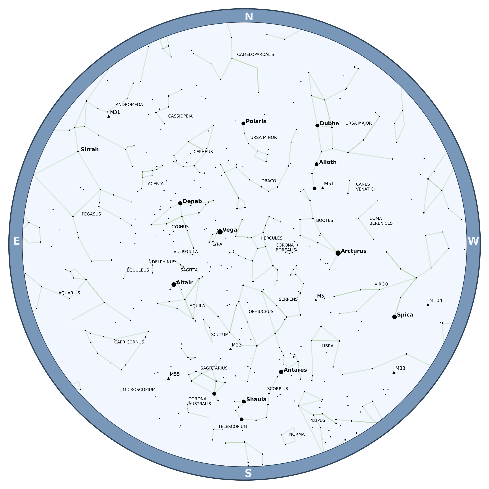
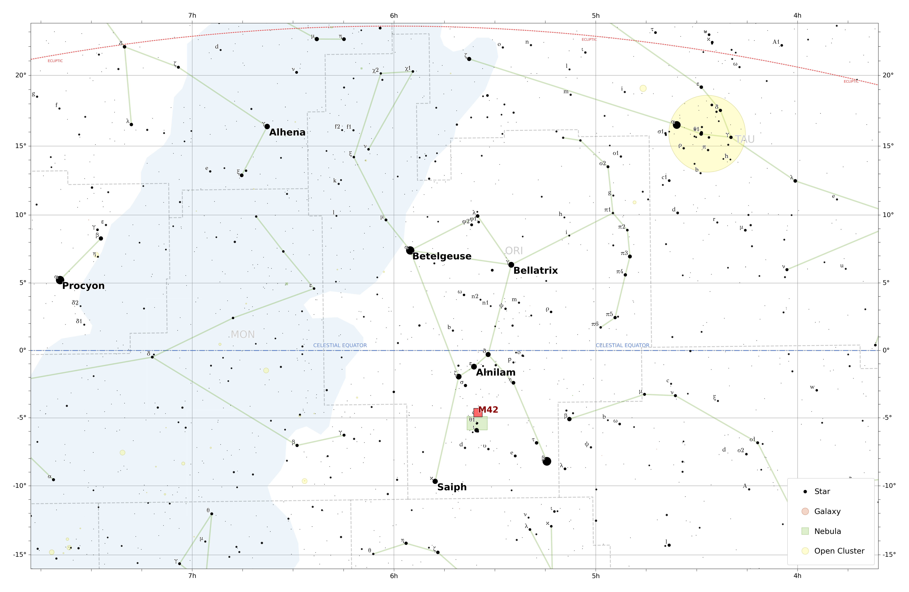
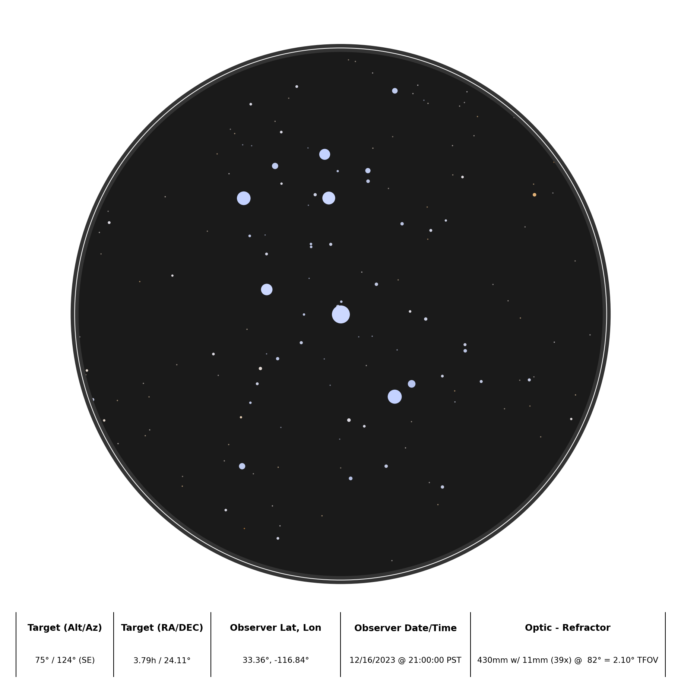

# Welcome to Starplot

Starplot is a Python library for creating star charts and maps.

- ⭐ **Zenith Plots** - showing the stars from a specific time/location

- 🗺️ **Map Plots** - including North/South polar and Mercator projections

- 🔭 **Optic Plots** - simulates what you'll see through an optic (e.g. telescope) from a time/location

- 🪐 **Planets and Deep Sky Objects (DSOs)**

- 🎨 **Custom Styles** - for all objects

- 📥 **Export** - png, svg

- 🧭 **Label Collision Avoidance**

!!! warning "Upgrading from `0.8.x` to `0.9.x`"

    The latest version of Starplot (`0.9.x`) has some major changes from the previous version (`0.8.x`). If you've been using Starplot since before `0.9.x`, then please check out the examples/reference to see what's changed. The major change is that everything must be explicitly plotted now.

    <a href="https://archives.starplot.dev/0.8.4/" rel="nofollow">Docs for 0.8.4 available here</a>

*Example charts and maps created with Starplot:*
<figure markdown>
  
  <figcaption>Zenith plot of the stars from a specific time/location (<a href="examples/#star-chart-for-timelocation">source code</a>)</figcaption>
</figure>

<figure markdown>
  
  <figcaption>Map around the constellation Orion, with an ellipse around Orion's Belt (<a href="examples/#map-of-orion">source code</a>)</figcaption>
</figure>

<figure markdown>
  
  <figcaption>Optic plot that shows what The Pleiades looked like through a refractor telescope on December 16, 2023 at 9pm PT from Palomar Mountain in California (<a href="examples/#optic-plot-of-the-pleiades-with-a-refractor-telescope">source code</a>)</figcaption>
</figure>

---

✨ [Check out more examples...](examples.md)
