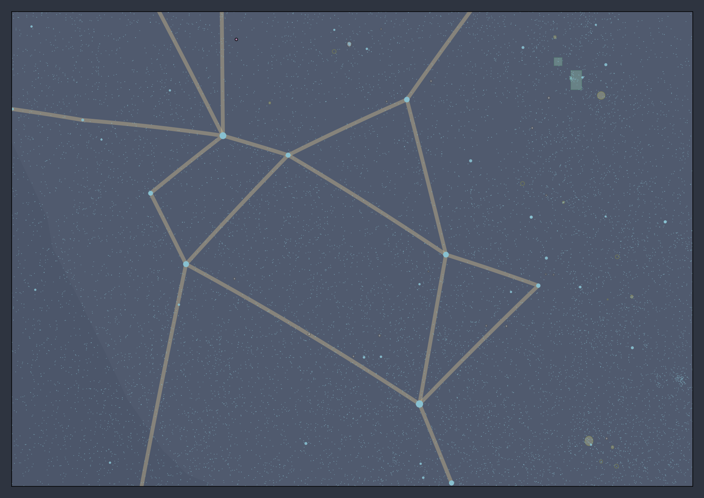

# Welcome to Starplot

Starplot is a Python library for creating star charts and maps.

- ⭐ **Zenith Plots** - showing the stars from a specific time/location

- 🗺️ **Map Plots** - including North/South polar and Mercator projections

- 🪐 **Planets and Deep Sky Objects (DSOs)**

- 🎨 **Custom Styles** - for all objects

- 📥 **Export** - png, svg

- 🧭 **Label Collision Avoidance**

*Example charts and maps created with Starplot:*
<figure markdown>
  
  <figcaption>Zenith plot of the stars from a specific time/location (<a href="examples/#star-chart-for-timelocation">source code</a>)</figcaption>
</figure>

<figure markdown>
  
  <figcaption>Map around the constellation Orion, with M42 marked (<a href="examples/#map-of-orion">source code</a>)</figcaption>
</figure>

<figure markdown>
  
  <figcaption>Map around the constellation Sagittarius, with a stereographic projection and dark color style</figcaption>
</figure>

---

✨ [Check out more examples...](examples.md)
