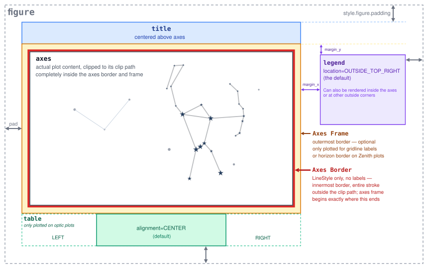

# Layout

Every plot you create with Starplot is built from a handful of regions, arranged around the axes (the actual plot area). Most of these regions are optional and only take up space in the figure if you actually use the feature they belong to — for example, if you don't plot a legend, no space is reserved for one.

## Figure

The outermost region is the exported image itself. Its size is determined automatically from everything you've plotted (the `resolution` you specify when creating a plot is the size of the axes, not necessarily the full exported image). You can add empty space around all the other regions with [`style.figure.padding`][starplot.PlotStyle.figure], and set a background color for the whole image with [`style.figure.background.fill_color`][starplot.PlotStyle.figure].

## Title

If you call a plot's [`title()`][starplot.MapPlot.title] function, it's plotted as a bar above the axes, centered horizontally over it.

## Axes

The axes is where your plot actually gets drawn — stars, constellations, DSOs, gridlines, and everything else you plot ends up here, clipped to the shape of the plot's extent (a rectangle for most map plots, but it can be other shapes too — for example, a circle for optic plots). You can style its background with [`style.axes.background`][starplot.PlotStyle.axes].

## Axes Border

A border can be drawn immediately around the axes, right at the edge of the plot's extent. It's styled with [`style.axes.border`][starplot.PlotStyle.axes], which is a [`LineStyle`][starplot.styles.LineStyle] — set it to `None` if you don't want a border at all.

## Axes Frame

A few features need some extra space just outside the axes border to plot labels: [`gridlines()`][starplot.MapPlot.gridlines] plots its hour/degree labels here, and horizon plots use it for cardinal direction labels (N/E/S/W). This "frame" region only appears when one of those features is used, and it always begins exactly where the axes border ends — so there's never a gap or an overlap between the two.

## Legend

If you call a plot's [`legend()`][starplot.MapPlot.legend] function, it's plotted next to the axes by default, but you can also position it at one of four corners *inside* the axes by setting [`style.legend.location`][starplot.styles.LegendStyle.location]. When it's plotted outside the axes, it adds to the overall size of the figure, and its distance from the axes is controlled by [`style.legend.margin_x`][starplot.styles.LegendStyle.margin_x] / [`style.legend.margin_y`][starplot.styles.LegendStyle.margin_y].

## Table

Optic plots can show a small table below the axes with details about the target, observer, and optic — call [`info()`][starplot.OpticPlot.info] to add it. Its horizontal alignment (left, center, or right) is controlled by [`style.table.alignment`][starplot.PlotStyle.table].

  
